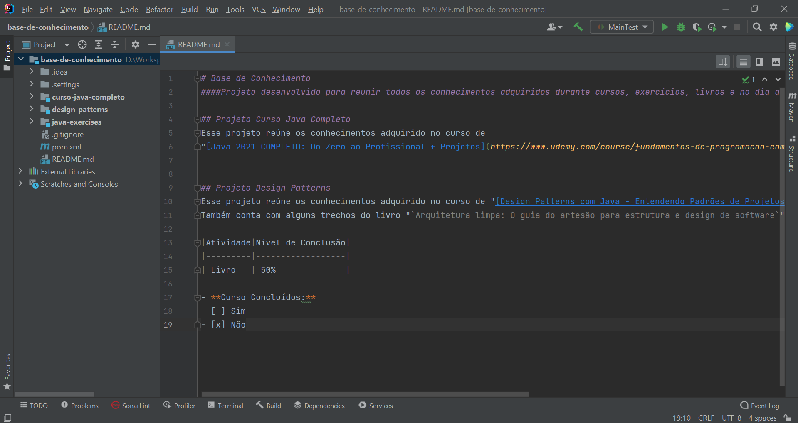

# Projeto: Base de Conhecimento
#### Projeto desenvolvido para reunir todos os conhecimentos adquiridos durante cursos, exercícios, livros e no dia a dia de desenvolvimento.

## Sub-projeto: Curso Java Completo
Esse projeto reúne os conhecimentos adquirido no curso de
"[Java 2021 COMPLETO: Do Zero ao Profissional + Projetos](https://www.udemy.com/course/fundamentos-de-programacao-com-java/)", disponível na Udemy.


## Sub-projeto: Design Patterns
Esse projeto reúne os conhecimentos adquirido no curso de "[Design Patterns com Java - Entendendo Padrões de Projetos](https://www.udemy.com/course/curso-design-patterns-java/)", disponível na Udemy.
Também conta com alguns trechos do livro "`Arquitetura limpa: O guia do artesão para estrutura e design de software`" de Robert C. Martin.

|Atividade|Nível de Conclusão|
|---------|------------------|
| Livro   | 60%              |

- **Curso Concluídos:**
- [ ] Sim
- [x] Não
## Sub-projeto: jpa-e-hibernate
Esse projeto reúne os conhecimentos adquirido no curso de "[Persistência com JPA: Introdução ao Hibernate](https://cursos.alura.com.br/course/persistencia-jpa-introducao-hibernate)", disponível na Alura.


## IDE utilizada: IntelliJ IDEA


## Tecnologias utilizadas:
 - Maven
 - Lombok
 - Java 8
 - JUnit
 - Log4J
 - SonarQube
 - JPA
 - Hibernate

[Pom Principal](pom.xml)

```
<properties>
<project.build.sourceEncoding>UTF-8</project.build.sourceEncoding>
<project.reporting.outputEncoding>UTF-8</project.reporting.outputEncoding>
<java.version>1.8</java.version>
<sonarqube.version>8.9.0.43852</sonarqube.version>
<sonarjava.version>6.15.1.26025</sonarjava.version>
<aggregate.report.dir>tests/target/site/jacoco-aggregate/jacoco.xml</aggregate.report.dir>
<logback.version>1.2.3</logback.version>
</properties>
```

## Heroku
- https://dashboard.heroku.com/apps/base-conhecimento/activity/builds/3b63fe80-90ea-4553-948a-0c27d78af4c9

> Autor: Ronison Matos
